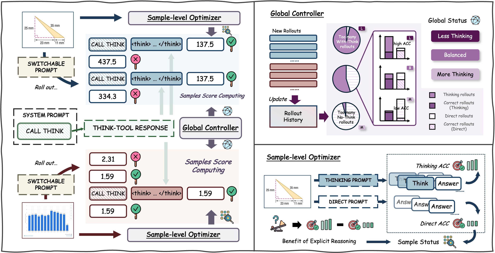

<h1 align="center">Switch-Reasoner: Learn When to Think in Multitask Mixtures via Reinforcement Learning</h1>

<p align="center"><em><strong>Yiyang Fang, Pei Fu, Jinjie Li, Jian Liang, Wenke Huang, Ruijie Luo, Shaojie Zhang, Jian Luan, Yi R. (May) Fung, Mang Ye</strong></em></p>

<p align="center">
<a href="https://arxiv.org/abs/2607.08572"></a>
<a href="https://huggingface.co/collections/fuyyy74/switch-reasoner"></a>
</p>



## Abstract

Multimodal Large Language Models (MLLMs) often follow a fixed Think-then-Answer paradigm, which is inefficient in heterogeneous multitask settings because simple inputs may not require explicit reasoning while difficult ones can benefit substantially from it. Learning when to think is also unstable during post-training, where imbalanced rollouts can drive the model toward always-thinking or always-direct behavior. We propose Switch-Reasoner, a GRPO-based framework that learns to adaptively select reasoning modes for MLLMs. It treats thinking as a virtual tool invocation and allows the model to either answer directly or invoke explicit reasoning before answering. To stabilize this decision, we introduce a dual-level regulation mechanism that balances the overall use of Thinking Mode and Direct Mode while providing sample-level supervision based on the relative benefit of the two choices. Experiments on 11 multimodal tasks show that Switch-Reasoner reduces unnecessary reasoning while maintaining strong performance, achieving a better accuracy-efficiency trade-off.

## Preparation

1. Clone this repository.

```Shell
git clone https://github.com/fuyyyyy/Switch-Reasoner.git
cd Switch-Reasoner
```

2. Create the environment.

```Shell
conda create -n switch-reasoner python=3.10
conda activate switch-reasoner
```

3. Install dependencies.

```Shell
pip install --no-cache-dir "vllm==0.11.0" "torch==2.8.0" "torchvision==0.23.0" "torchaudio==2.8.0" tensordict torchdata \
    "transformers[hf_xet]>=4.51.0" accelerate datasets peft hf-transfer \
    "numpy<2.0.0" "pyarrow>=15.0.0" "grpcio>=1.62.1" "optree>=0.13.0" pandas \
    "ray[default]" codetiming hydra-core pylatexenc qwen-vl-utils wandb liger-kernel mathruler \
    pytest yapf py-spy pre-commit ruff
    
pip install flash-attn==2.7.4.post1 --no-build-isolation
pip install flashinfer-python==0.2.2
```

## Usage

1. Download datasets and model weights.

The datasets and model weights are available in our Hugging Face collection:

```Shell
https://huggingface.co/collections/fuyyy74/switch-reasoner
```

2. Configure paths.

Set the model, data, and output paths according to your environment.

```Shell
export MODEL_PATH=/path/to/Qwen3-VL-4B-Instruct
export TRAIN_FILE=/path/to/multitask_train.parquet
export VAL_FILE=/path/to/multitask_test.parquet
export OUTPUT_DIR=outputs/switch-reasoner
```

3. Run training.

For Qwen3-VL-4B:

```Shell
bash examples/switch-reasoner-4B.sh
```

For Qwen3-VL-8B:

```Shell
bash examples/switch-reasoner-8B.sh
```

4. Merge the model.

```Shell
python3 scripts/model_merger.py \
  --local_dir outputs/think_tools_multi/<experiment_name>/global_step_<step>/actor
```

or edit and run:

```Shell
bash scripts/merge.sh
```

## Citation

Please kindly cite this work in your publications if it helps your research:

```bibtex
@article{fang2026switch,
  title={Switch-Reasoner: Learn When to Think in Multitask Mixtures via Reinforcement Learning},
  author={Fang, Yiyang and Fu, Pei and Li, Jinjie and Liang, Jian and Huang, Wenke and Luo, Ruijie and Zhang, Shaojie and Luan, Jian and Fung, Yi R. and Ye, Mang},
  journal={arXiv preprint arXiv:2607.08572},
  year={2026}
}
```

## Acknowledge

Our repo is built on EasyR1. We thank the authors for sharing their code.
